# PENGANTAR KONSEP PEMROGRAMAN BERORIENTASI OBJEK

<h4>Nama: Muhammad Hafiz<h4>
<h4>NIM: 254107020056 <h4>
<h4>Kelas: TI - 2G <h4>

## Percobaan 1
Kode:
1. 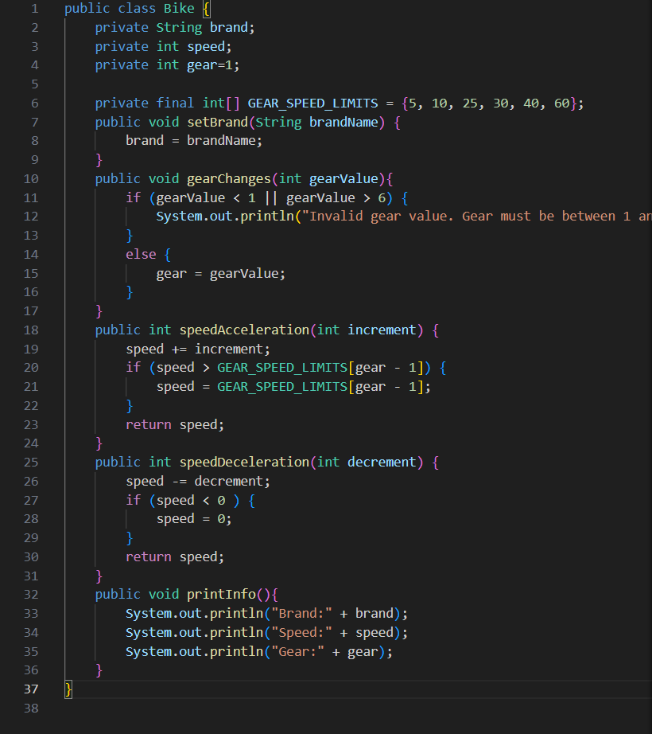
2. 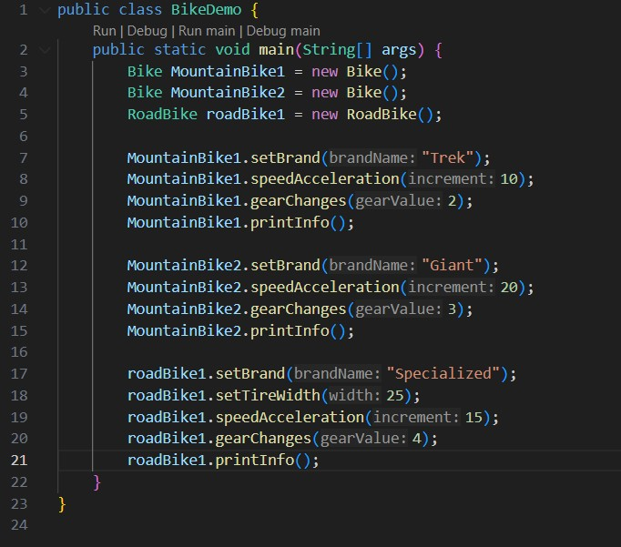
3. 

Output:
1. 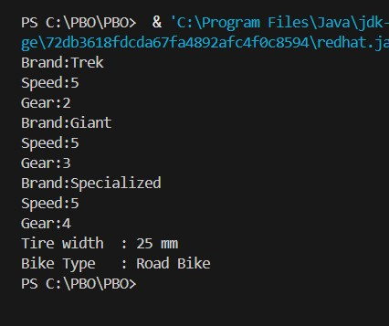

## Percobaan 2
1. 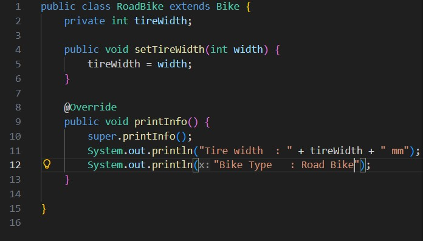

## Pertanyaan
1. Jelaskan perbedaan antara object dengan class! 
2. Jelaskan alasan gear dan brand dapat menjadi atribut dari object Bike! 
3. Sebutkan salah satu kelebihan utama dari pemrograman berorientasi objek dibandingkan dengan pemrograman prosedural! 
4. Apakah diperbolehkan melakukan pendefinisian dua buah atribut dalam satu baris kode seperti “public String nama, alamat;”? 
5. Pada class RoadBike, jelaskan alasan atribut brand, speed, dan gear tidak lagi ditulis di dalam class tersebut!  

### Jawaban
1. Class adalah rancangan, cetak biru, atau blueprint teoritis yang mendefinisikan struktur dan perilaku. Sebaliknya, object adalah bentuk fisik atau entitas nyata (instansiasi) yang diciptakan berdasarkan cetak biru tersebut dan menempati ruang di memori komputer.
2. Atribut bertugas menyimpan status, data, atau karakteristik dari sebuah object. Di dunia nyata, sebuah sepeda pasti memiliki identitas berupa merek (brand) dan komponen penggerak seperti gigi (gear). Oleh karena itu, keduanya sangat relevan dijadikan atribut untuk mendefinisikan karakteristik object Bike dalam kode.
3. Keunggulan utamanya adalah reusability (penggunaan ulang kode) dan modularitas. OOP memecah program menjadi objek-objek yang saling berinteraksi menyerupai konsep dunia nyata, sehingga sistem yang kompleks menjadi jauh lebih mudah dipelihara, diperbaiki, dan dikembangkan tanpa harus merombak seluruh alur program.
4. diperbolehkan dalam bahasa pemrograman berorientasi objek. Syarat mutlaknya adalah variabel-variabel yang dideklarasikan secara bersamaan tersebut harus berbagi tipe data (String) dan access modifier (public) yang persis sama.
5. Hal ini adalah hasil dari penerapan konsep Inheritance atau pewarisan. RoadBike berstatus sebagai kelas turunan (child class) dari kelas induknya, yaitu Bike. Berdasarkan prinsip pewarisan, kelas turunan secara otomatis menerima dan bisa menggunakan seluruh atribut milik kelas induknya (seperti brand, speed, dan gear), sehingga penulisan ulang kode dapat dihindari.  

## Tugas Praktikum
1. Lakukan langkah-langkah berikut supaya tugas praktikum yang dikerjakan tersistematis:
- Foto 4 buah objek di sekitar kalian dengan 2 objek di antaranya merupakan objek yang
mengandung konsep pewarisan (inheritance), contoh: kulkas, kursi, meja ruang tamu, meja
belajar sehingga diketahui meja ruang tamu dan meja belajar mewarisi objek meja!
- Lakukan pengamatan terhadap 4 objek tersebut untuk menentukan atribut dan methodnya!
- Berdasarkan 4 buah objek tersebut, buat class nya dalam Bahasa pemrograman Java!
- Perlu diperhatikan bahwa terdapat dua class hasil pewarisan sehingga perlu menambah satu
class baru sebagai class yang mewarisi dua class tersebut!
- Tambahkan dua atribut untuk setiap class!
- Tambahkan tiga method untuk setiap class termasuk method cetak informasi!
- Tambahkan satu class Demo sebagai main!
- Instansiasikan satu buah objek untuk setiap class!
- Terapkan setiap method untuk setiap objek yang dibuat!
- Contoh yang telah disebutkan pada poin 1.a tidak diperbolehkan dipakai dalam pengerjaan tugas praktikum ini!

### Jawaban
1. Identifikasi 4 objek dan konsep pewarisan:
> Objek 1 (Tanpa Pewarisan): Router
> Objek 2 (Tanpa Pewarisan): Microphone
> Objek 3 (Pewarisan 1): Laptop
> Objek 4 (Pewarisan 2): PC Desktop
2. Atribut dan Method:
> Router
>> Atribut: merk, jumlahAntena
>> Method: pancarkanSinyal(), restartPerangkat(), cetakInformasi()

> Microphone
>> Atribut: merk, jenisKonektor
>> Method: tangkapSuara(), muteSuara(), cetakInformasi()

> Komputer (Parent Class untuk Objek 3&4)
>> Atribut: sistemOperasi, kapasitasRAM
>> Method: booting(), shutDown(), cetakInformasi()

> Laptop (Child Class 1)
>> Atribut tambahan: kapasitasBaterai, ukuranLayar
>> Method tambahan: isiDaya(), lipatLayar(), cetakInformasi()

> PC Desktop (Child Class 2)
>> Atribut Tambahan: dayaPSU, jenisCasing
>> Method tambahan: gantiKomponen(), nyalakanKipas(), cetakInformasi

3. 
Kode: 
> 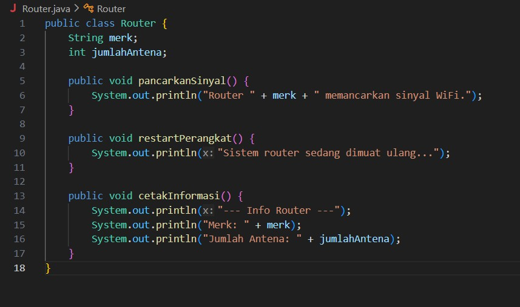
> 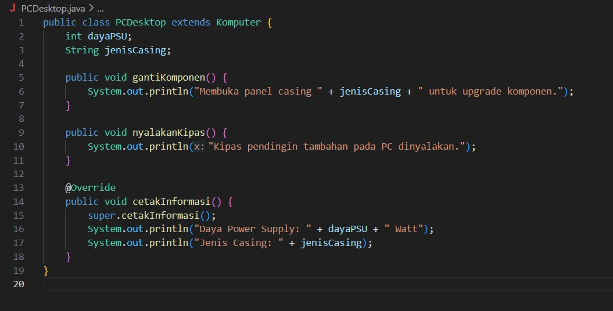
> 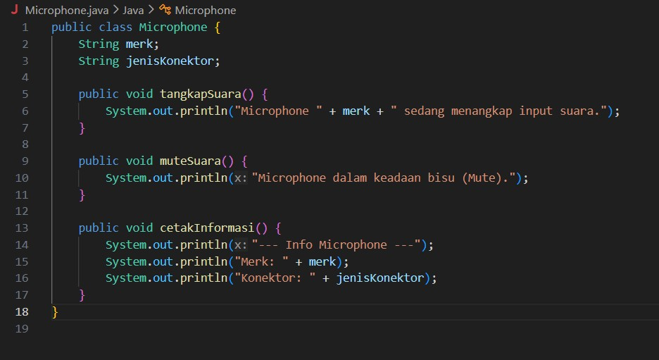
> 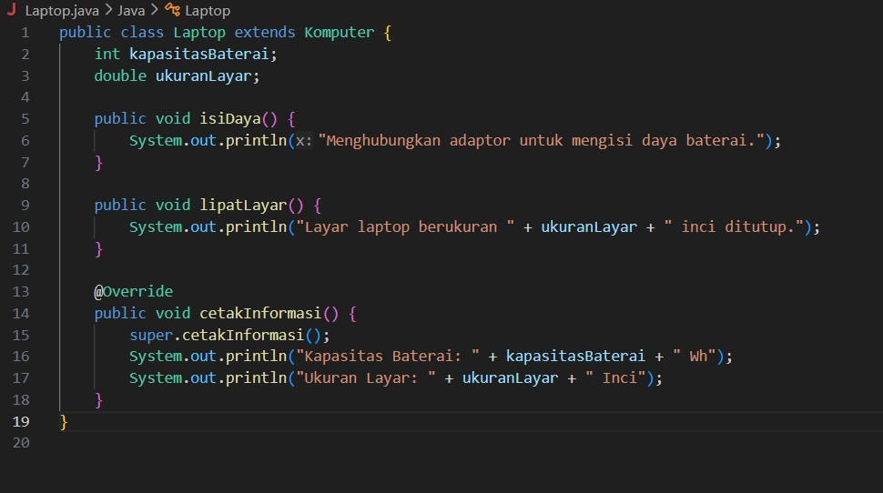
> 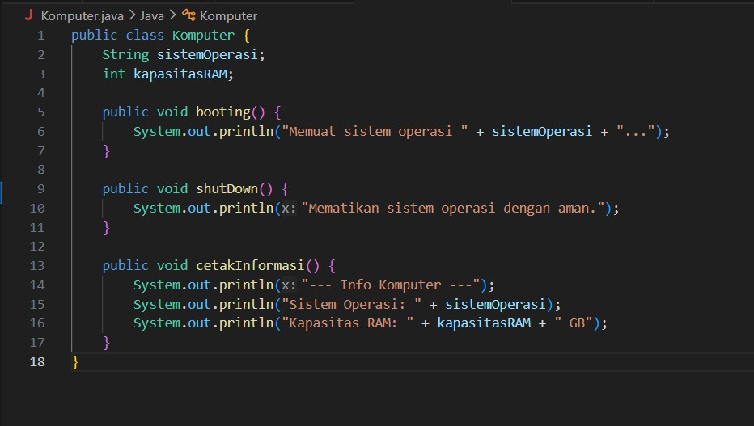
> 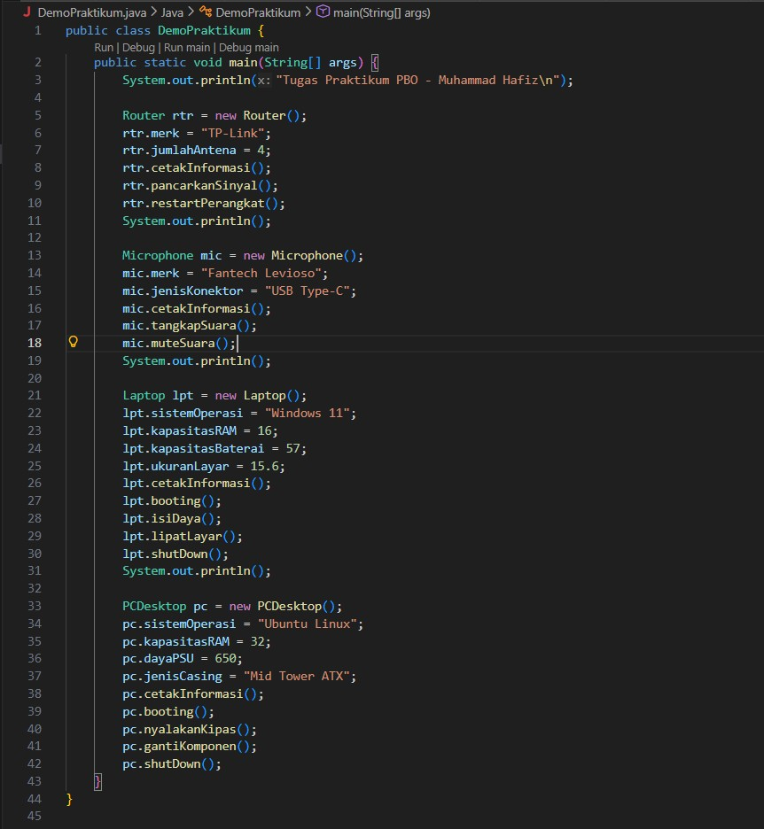

Output:
> 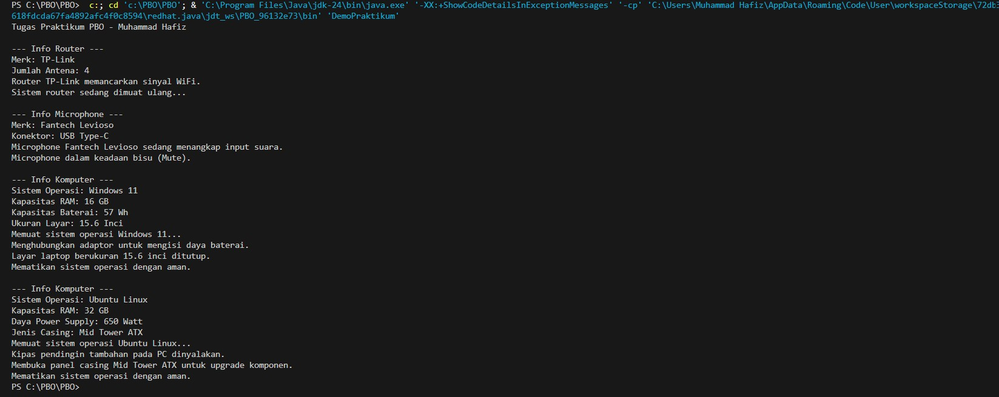