# Class & Object

<h4>Nama: Muhammad Hafiz<h4>
<h4>NIM: 254107020056 <h4>
<h4>Kelas: TI - 2G <h4>

## Langkah 1: Buat Proyek
> 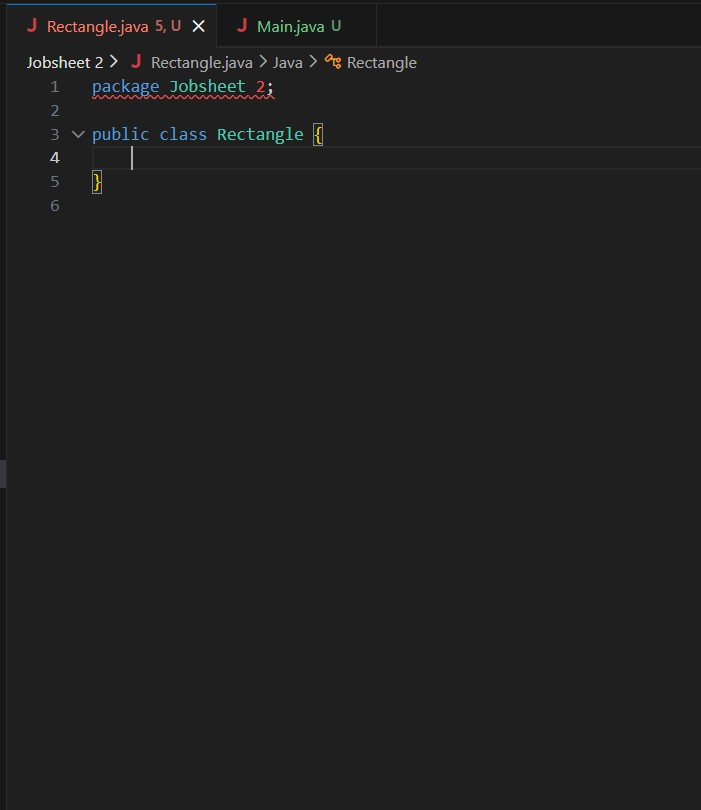

## Langkah 2: Kelas Rectangle minimal dan objek pertama
> 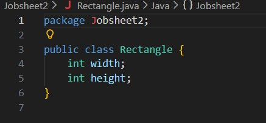
> 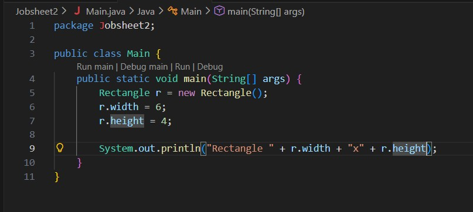
> 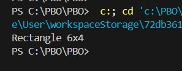

## Langkah 3: Menambahkan Method (Perilaku)
> 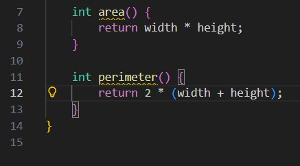
> 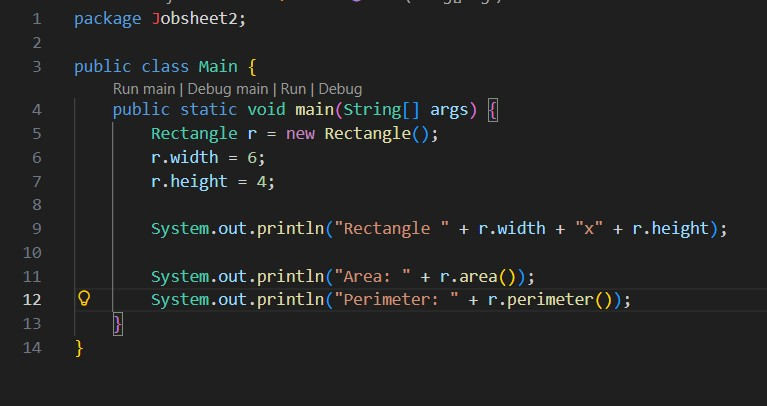
> 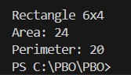

## Langkah 4: Konstruktor dan this
> 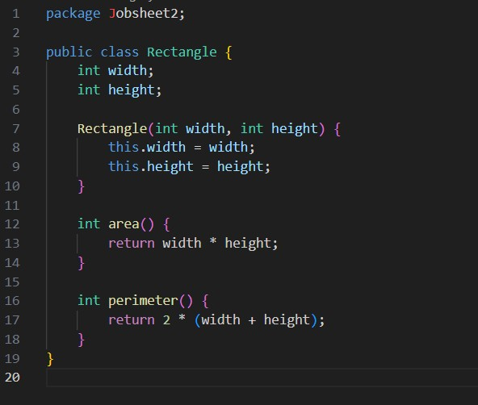
> 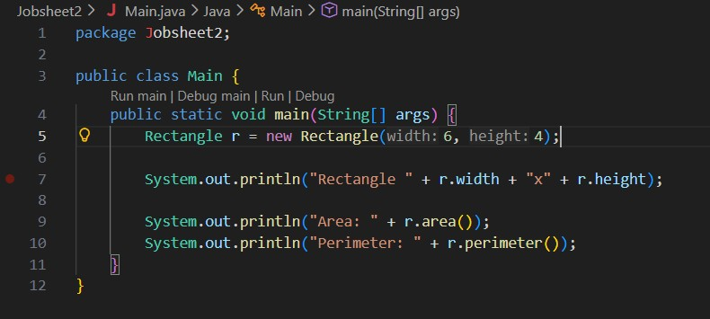

## Langkah 5: Referensi, Aliasing, dan null
> 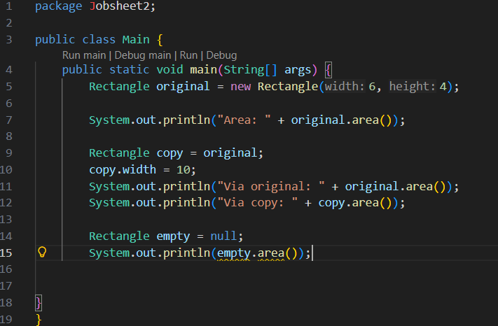
> 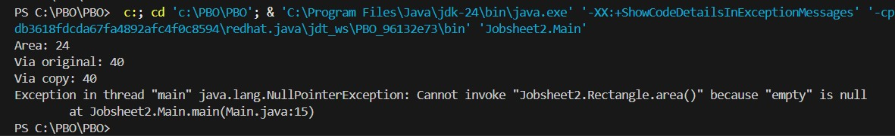
> 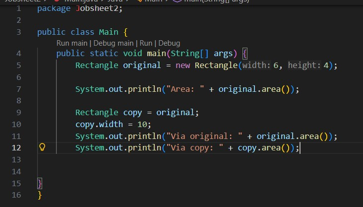
> 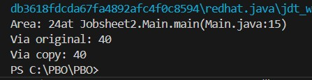

## Langkah 6: Kelas Student dari diagram UML
> 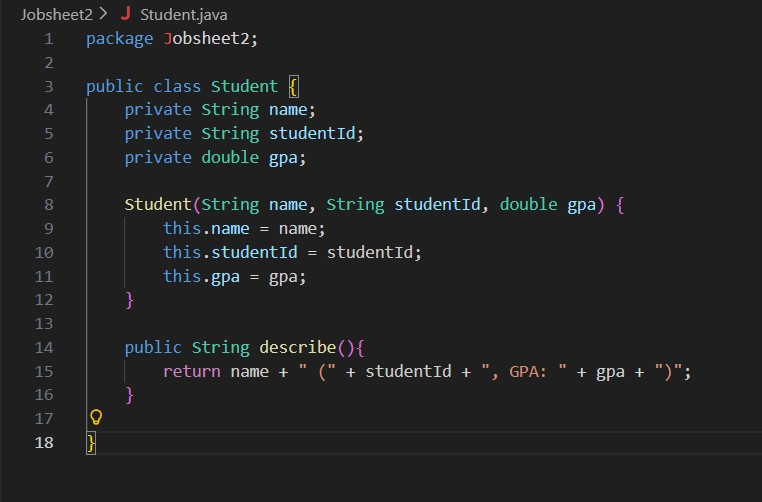
> 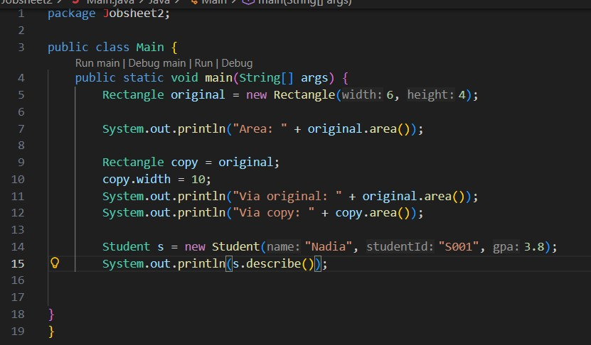
> 

## Langkah 7: Array of Objects, Banyak Objek dari Satu Kelas
> 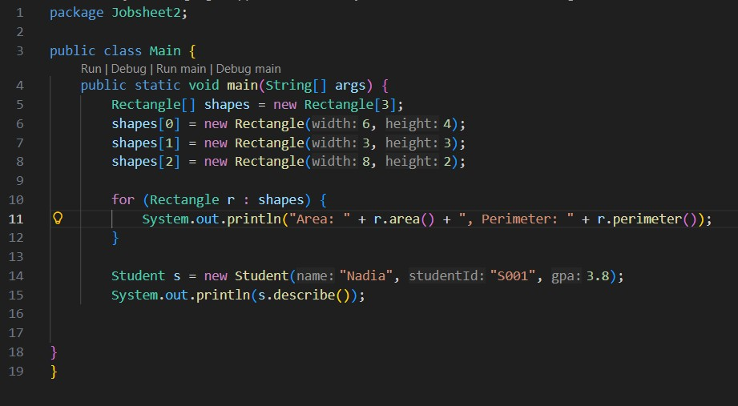
> 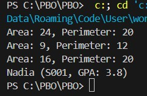

## Tugas Mandiri
1. Buat kelas Circle sesuai diagram UML berikut:
Method area() dan circumference() mengembalikan double, hitung pakai rumus
lingkaran biasa (Math.PI * radius * radius untuk luas, 2 * Math.PI * radius untuk keliling). Buktikan dengan membuat satu objek Circle di Main (radius 5) dan mencetak kedua hasilnya.
2. Jawab singkat (2-3 kalimat masing-masing): (a) apa bedanya objek dengan referensi ke objek? (b) tepatnya kapan konstruktor sebuah kelas dijalankan?

### Jawaban
1. 
> 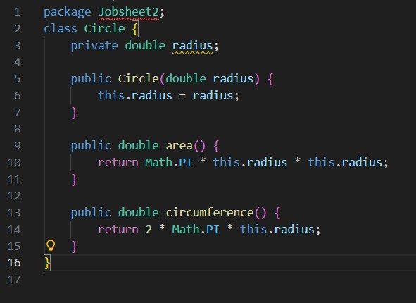
> 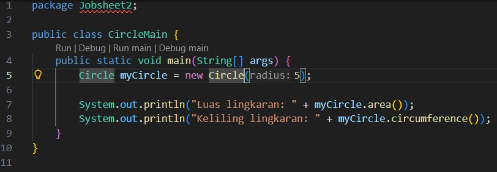
> 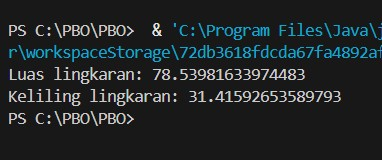

2. 
>(a) Perbedaan objek dengan referensi ke objek: Objek adalah entitas instansiasi nyata yang menempati ruang di memori utama (heap) dan menyimpan data aktual. Sementara itu, referensi ke objek adalah variabel yang hanya menyimpan alamat memori dari tempat objek tersebut berada, berfungsi sebagai penunjuk untuk mengakses dan memanipulasi data di dalam objek.

> (b) Waktu eksekusi konstruktor kelas: Konstruktor dieksekusi secara otomatis dan tepat satu kali pada saat pembuatan instansiasi objek baru menggunakan keyword new. Proses ini berjalan untuk mengalokasikan memori sekaligus menginisialisasi nilai awal (state) atribut kelas sebelum objek tersebut mulai digunakan dalam program.
