# Enkapsulasi Pada Pemrograman Berorientasi Objek

<h4>Nama: Muhammad Hafiz<h4>
<h4>NIM: 254107020056 <h4>
<h4>Kelas: TI - 2G <h4>

## Percobaan 1 - Enkapsulasi
> 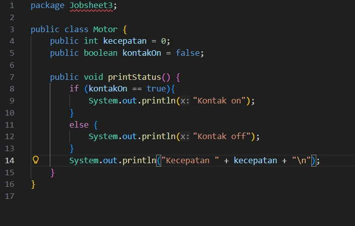
> 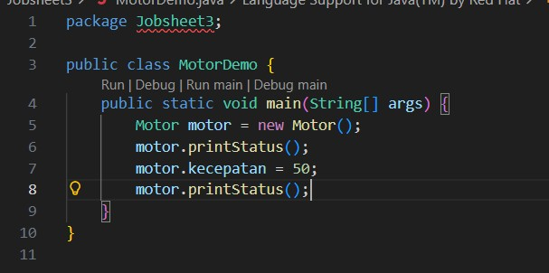
> 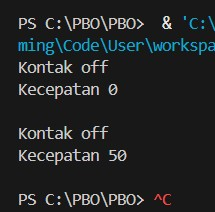

## Percobaan 2 - Access Modifier
> 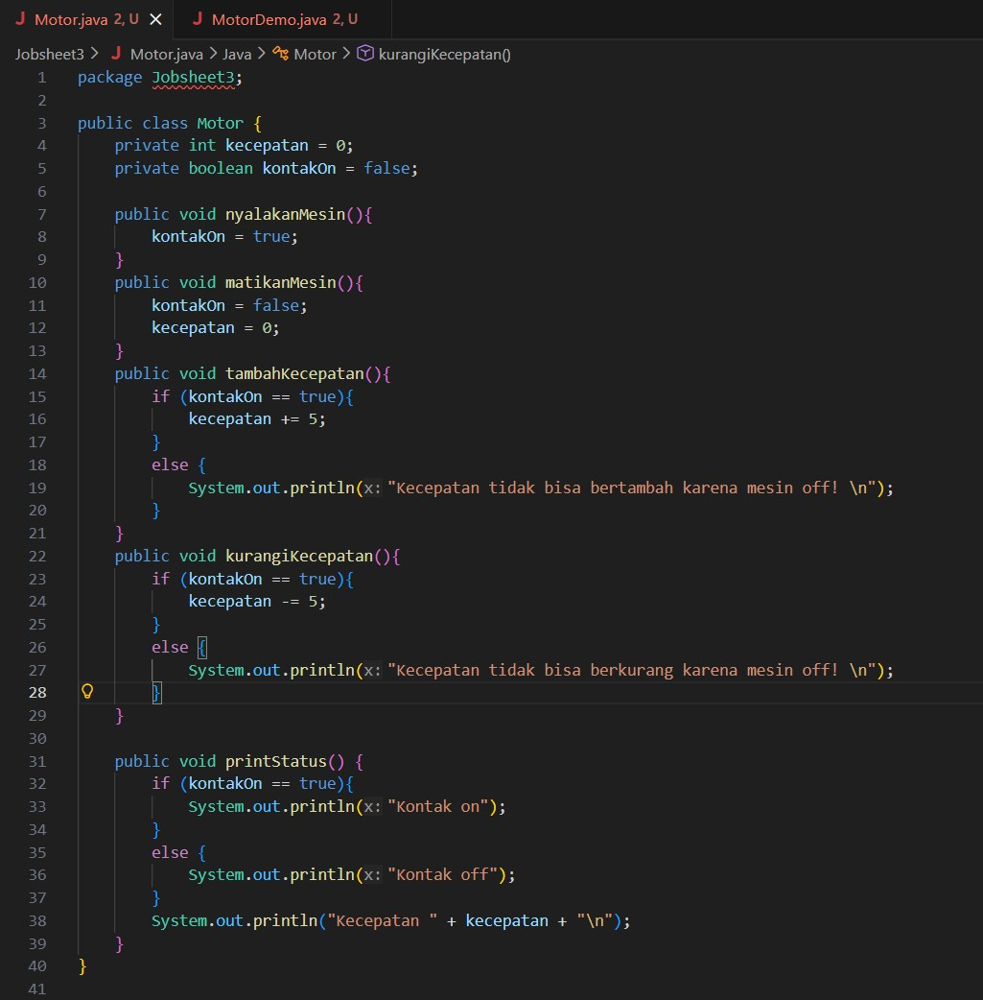
> 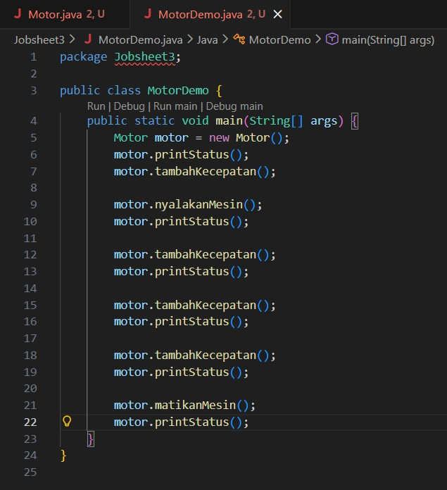
> 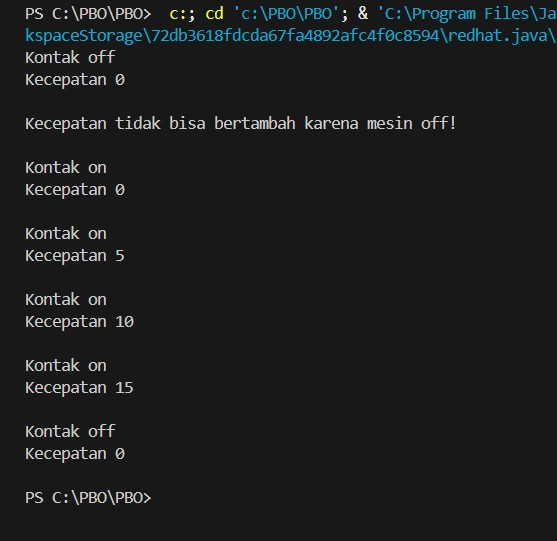

### Pertanyaan
1. Pada class TestMobil, saat kita menambah kecepatan untuk pertama kalinya, mengapa muncul peringatan “Kecepatan tidak bisa bertambah karena Mesin Off!”?
2. Mengapa atribut kecepatan dan kontakOn diset private?
3. Ubah class Motor sehingga kecepatan maksimalnya adalah 100!

### Jawaban
1. Tepat sebelum method motor.nyalakanMesin(); dipanggil di baris 9. Karena nilai default dari atribut kontakOn adalah false, kondisi if (kontakOn == true) pada method tambahKecepatan() tidak terpenuhi, sehingga blok else tereksekusi dan mencetak peringatan.
2. 
> Perlindungan Data: Mencegah modifikasi data secara sembarangan dari luar class. Pengguna tidak bisa mengetikkan motor.kecepatan = 1000; langsung dari MotorDemo.

> Validasi Logika: Memaksa perubahan nilai agar harus melewati method yang sudah ditentukan (seperti tambahKecepatan()). Hal ini memastikan sistem selalu memvalidasi state objek (misalnya, memastikan mesin menyala sebelum kecepatan bisa bertambah).
3. > 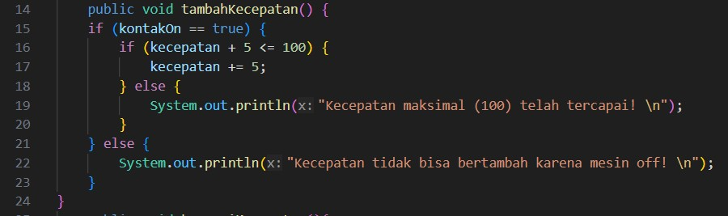

## Percobaan 3 - Getter dan Setter
> 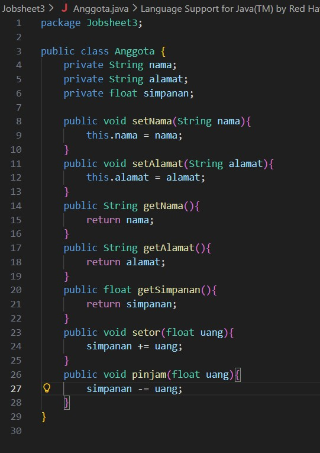
> 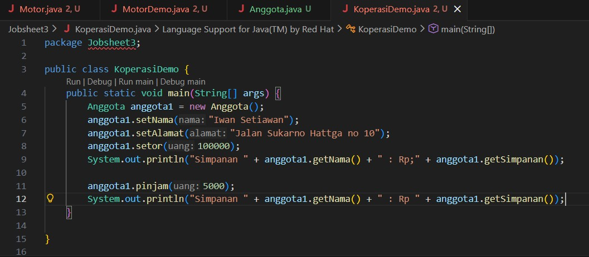
> 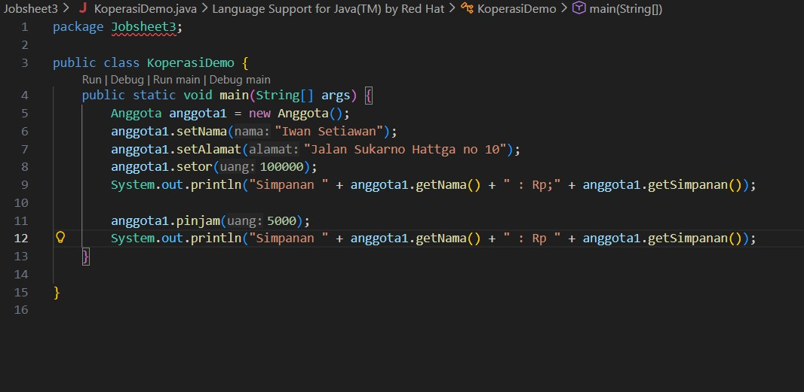

## Percobaan 4 - Konstruktor, Instansiasi
> 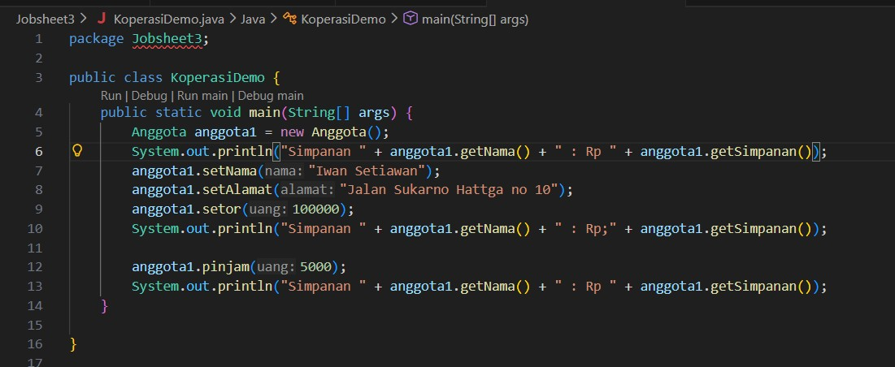
> 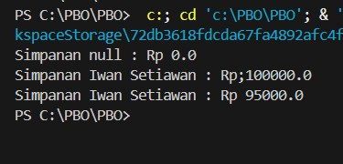
> 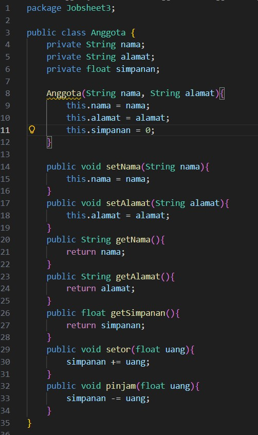
> 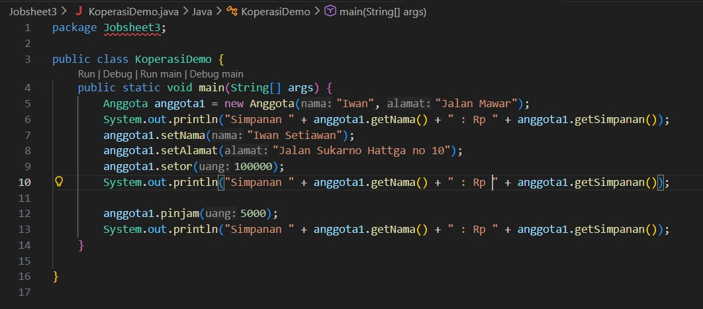
> 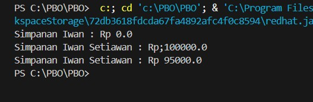

### Pertanyaan - Percobaan 3 dan 4
1. Apa yang dimaksud getter dan setter?
2. Apa kegunaan dari method getSimpanan()?
3. Method apa yang digunakan untuk menambah saldo?
4. Apa yang dimaksud konstruktor?
5. Sebutkan aturan dalam membuat konstruktor?
6. Apakah boleh konstruktor bertipe private?
7. Kapan menggunakan konstruktor dengan passing parameter?
8. Apa perbedaan inisialisasi atribut dan instansiasi atribut?
9. Apa perbedaan inisialisasi method dan instansiasi method? 

### Jawaban
1. Getter dan Setter: Getter adalah method yang digunakan untuk mengambil atau membaca nilai dari atribut yang dienkapsulasi (private). Setter adalah method yang digunakan untuk mengubah atau mengisi nilai pada atribut private tersebut.
2. Kegunaan getSimpanan(): Method ini digunakan untuk mengembalikan (me-return) nilai yang tersimpan dalam atribut simpanan agar nilainya bisa dibaca dari luar class Anggota.
3. Method Menambah Saldo: Method setor(float uang) digunakan untuk menambah saldo menggunakan sintaks "simpanan += uang;".
4. Konstruktor: Sebuah method khusus yang secara otomatis dieksekusi ketika sebuah objek pertama kali dibuat (diinstansiasi). Fungsinya secara umum adalah untuk memberikan nilai awal (inisialisasi) pada atribut-atribut objek tersebut.
5. Aturan membuat konstruktor:
> Namanya harus sama persis dengan nama class (contoh: class Anggota menggunakan konstruktor bernama Anggota).

> Tidak boleh memiliki tipe nilai kembalian (return type), termasuk tidak boleh menggunakan keyword void.
6. Konstruktor Boleh bertipe private. Namun dampaknya, class tersebut tidak bisa diinstansiasi menjadi objek (menggunakan keyword new) dari class lain.
7.  Passing Parameter digunakan saat ingin langsung menetapkan nilai spesifik yang dinamis (seperti nama dan alamat tertentu) ke dalam atribut objek tepat pada saat objek tersebut diciptakan, sehingga menghemat baris kode ketimbang menggunakan setter satu per satu.
8. Perbedaan Inisialisasi dan Instansiasi Atribut:
> Instansiasi adalah proses penciptaan wujud objek nyata di dalam memori komputer, yang ditandai dengan penggunaan keyword new (contoh: new Anggota(...)).

> Inisialisasi adalah proses pemberian nilai awal pada atribut-atribut di dalam objek yang sudah tercipta tersebut (contoh: this.simpanan = 0;).

9. Instansiasi adalah proses mutlak untuk menciptakan objek dari sebuah blueprint/class (dengan keyword new), sedangkan Inisialisasi adalah pemberian nilai awal pada sebuah variabel/atribut. Method tidak diciptakan menjadi wujud baru, melainkan sekadar dijalankan/dipanggil kodenya.

## Tugas
1. Cobalah program dibawah ini dan tuliskan hasil outputnya
2. Pada program diatas, pada class EncapTest kita mengeset age dengan nilai 35, namun pada saat ditampilkan ke layar nilainya 30, jelaskan mengapa.
3. Ubah program diatas agar atribut age dapat diberi nilai maksimal 30 dan minimal 18.
4. Pada sebuah sistem manajemen pergudangan kargo ekspedisi, terdapat class Kontainer yang memiliki atribut antara lain nomorResi, namaPemilik, kapasitasMaksimal (dalam kg), dan beratMuatanSaatIni. Kontainer dapat menerima tambahan muatan barang dengan batasan kapasitas maksimal yang telah ditentukan. Kontainer juga dapat diturunkan muatannya (bongkar muat). Ketika barang diturunkan, maka jumlah muatan saat ini akan berkurang sesuai dengan nominal berat yang dikeluarkan. Buatlah class Kontainer tersebut, berikan atribut (private), method getter, dan konstruktor sesuai dengan kebutuhan arsitektur enkapsulasi. Uji dengan kelas driver TestLogistik berikut ini untuk memeriksa apakah manajemen state kelas Anda telah berjalan dengan benar:
5. Modifikasi soal kargo logistik di atas agar nominal berat muatan yang dibongkar/diturunkan dalam satu kali pemanggilan method turunkanMuatan() maksimal hanya boleh sebesar 50% dari total berat muatan saat ini. Langkah ini diterapkan demi alasan keselamatan kerja operasional alat berat (crane). Jika operator mencoba menurunkan muatan melebihi batas 50% tersebut, sistem harus memblokir aksi dan memunculkan peringatan: "Maaf, demi keselamatan, pembongkaran muatan satu kali jalan tidak boleh melebihi 50% dari muatan saat ini!".
6. Modifikasi kelas Main TestLogistik agar parameter jumlah berat barang yang dimasukkan (tambahMuatan) maupun berat barang yang dibongkar (turunkanMuatan) dapat menerima input nilai dinamis dari pengguna secara interaktif melalui terminal menggunakan utilitas java.util.Scanner.
7.  Sebuah aplikasi pemesanan tiket bioskop memerlukan kelas Tiket untuk mengelola data pemesanan secara aman. Kelas ini harus memiliki atribut private: judulFilm (String), hargaDasar (double), dan statusPembayaran (boolean). Ketentuan pengesetan nilai objek:
● Konstruktor harus menerima parameter judulFilm dan hargaDasar. Nilai awal
statusPembayaran selalu diset false (Belum Dibayar).
● Atribut hargaDasar tidak boleh bernilai negatif. Jika input yang dimasukkan kurang dari 0, otomatis set nilai default ke Rp 35.000.
● Sediakan method lakukanPembayaran() untuk mengubah statusPembayaran menjadi true.
● Nilai statusPembayaran hanya boleh dibaca (Read-Only) menggunakan getter, tidak boleh memiliki fungsi setter langsung dari luar kelas demi alasan keamanan transaksi.
● Uji kode Anda menggunakan kelas TestBioskop berikut:

## Jawaban
1. > 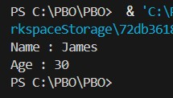
2. Nilai menjadi 30 karena pada method setAge() terdapat kondisi if (newAge > 30). Jika nilai input lebih besar dari 30 (seperti 35), program otomatis menahannya di angka maksimal, yaitu 30.
3. > 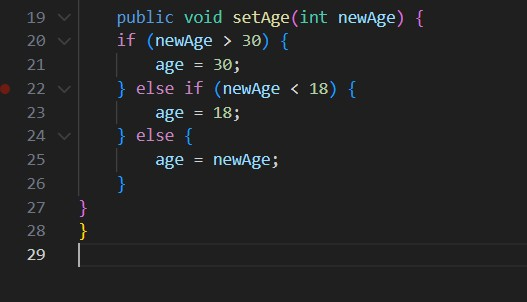
4. 
> 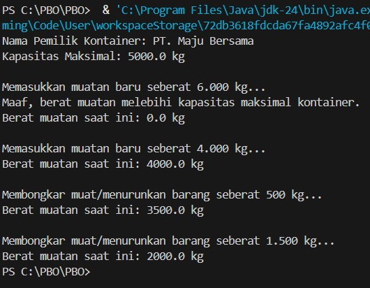
> 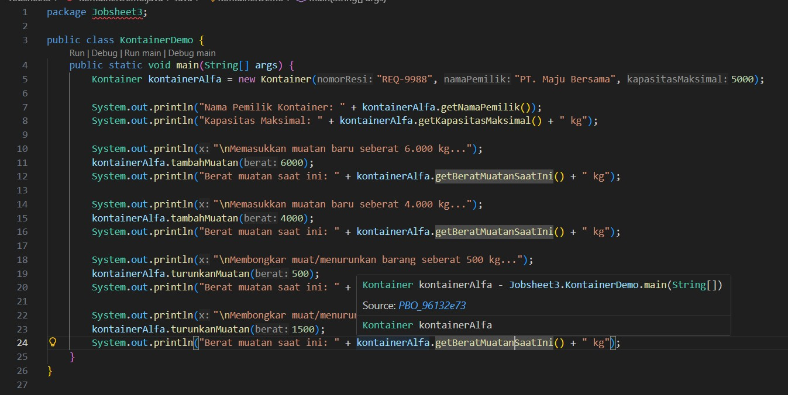
> 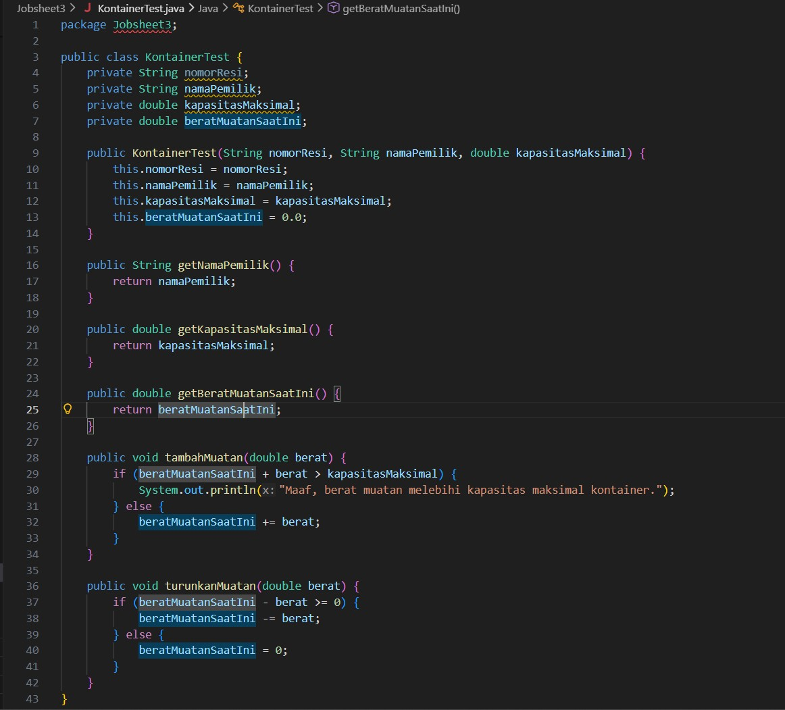

5. 
> 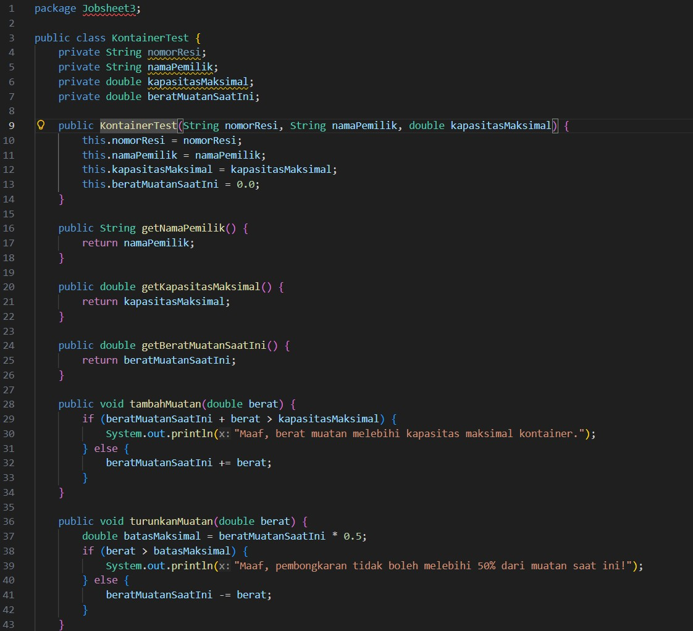
> 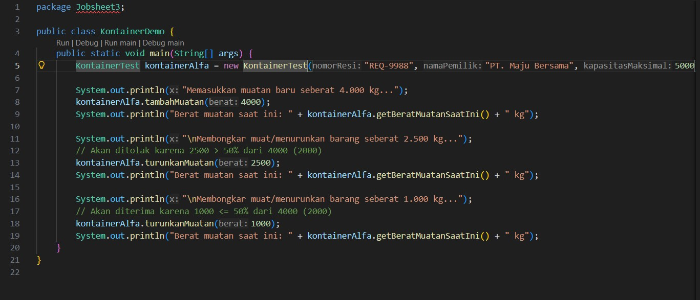
> 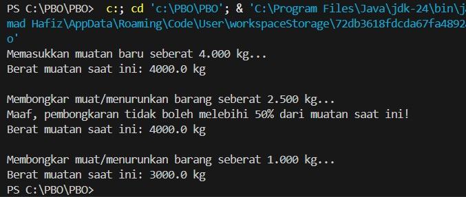
6. 
> 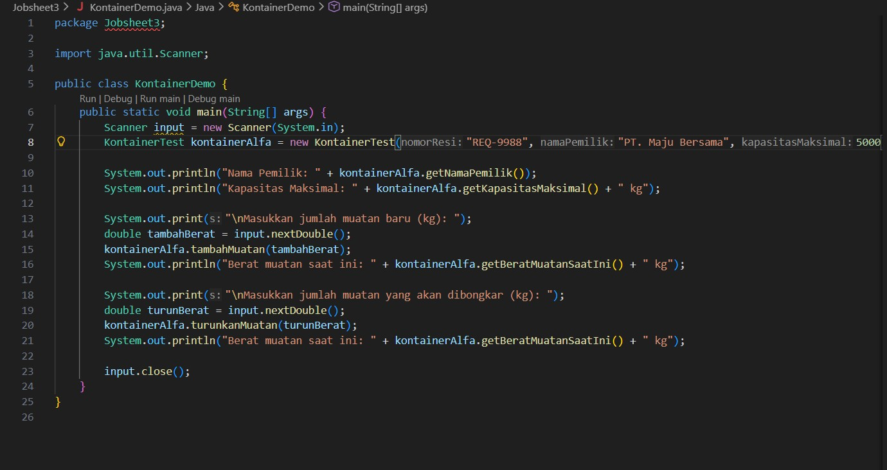
7. 
> 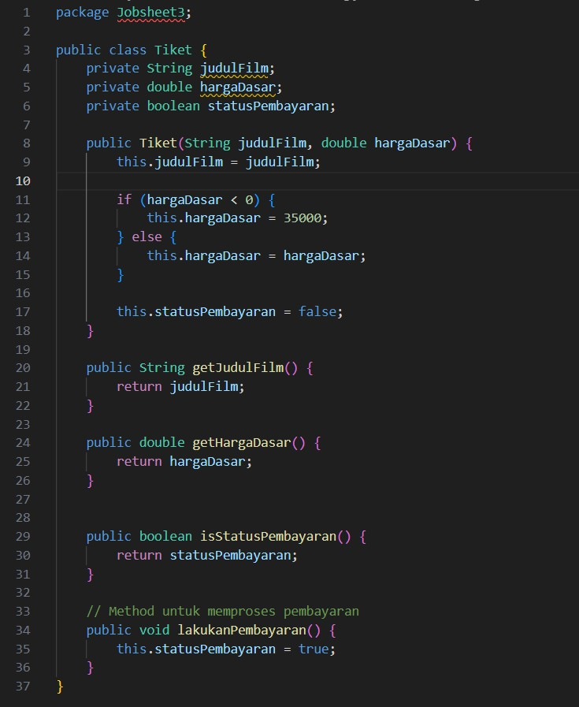
> 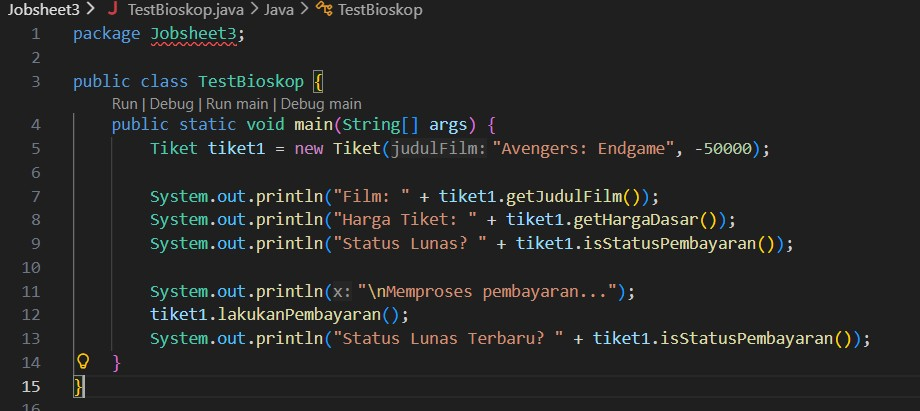
> 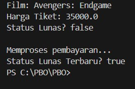