# Relasi Kelas: Aggregation, Composition, dan Dependency

<h4>Nama: Muhammad Hafiz<h4>
<h4>NIM: 254107020056 <h4>
<h4>Kelas: TI - 2G <h4>

## Percobaan 1: Aggregation Satu-ke-Satu (Laptop dan Processor)

> 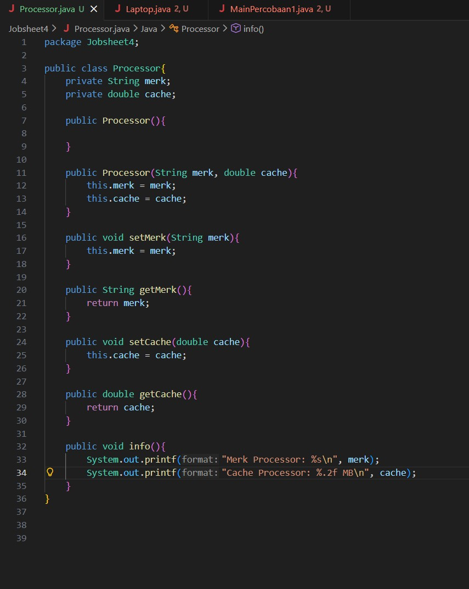
> 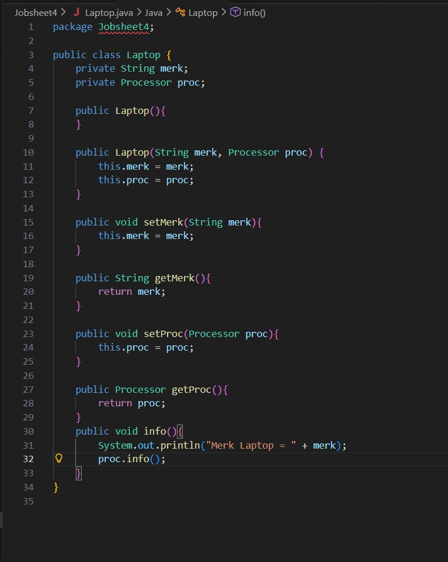
> 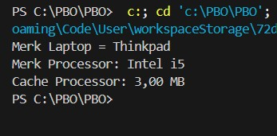
> 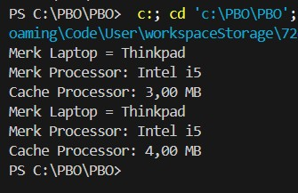
> 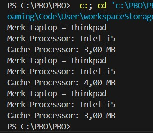

### Pertanyaan
1. Di dalam class Processor dan class Laptop, terdapat method setter dan getter untuk masingmasing atributnya. Apakah gunanya method setter dan getter tersebut?
2. Di dalam class Processor dan class Laptop, masing-masing terdapat konstruktor default dan konstruktor berparameter. Bagaimanakah beda penggunaan dari kedua jenis konstruktor tersebut?
3. Perhatikan class Laptop, di antara 2 atribut yang dimiliki (merk dan proc), atribut manakah yang bertipe object? Baris kode manakah yang menunjukkan bahwa class Laptop memiliki relasi dengan class Processor?
4. Perhatikan pada class Laptop, apakah guna dari sintaks proc.info()?
5. Pada Langkah 8, objek p dibuat lebih dulu baru diberikan ke constructor Laptop. Pada Langkah 10, objek Processor dibuat langsung di dalam argumen constructor Laptop (tanpa variabel p). Apakah keduanya menghasilkan output yang berbeda? Mengapa?
6. Secara kode, apakah relasi Laptop-Processor pada percobaan ini termasuk Aggregation atau Composition? Tunjukkan baris kode yang menjadi bukti jawabanmu.
7. Andaikan constructor Laptop diubah menjadi seperti berikut, sehingga Processor dibuat sendiri di dalam Laptop, bukan diterima sebagai parameter:
 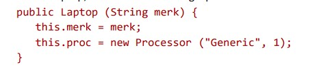

Apakah relasi Laptop-Processor pada versi ini masih Aggregation? Jelaskan alasannya (jawaban ini akan kita buktikan sendiri lewat kode pada Percobaan 5).

### Jawaban
1. Setter berfungsi untuk mengisi atau mengubah nilai atribut, sedangkan getter berfungsi untuk mengambil atau membaca nilai atribut tersebut.
2. Konstruktor default menginisialisasi objek dengan nilai atribut kosong atau bawaan, sedangkan konstruktor berparameter langsung mengisi nilai atribut dengan data spesifik saat objek dibuat.
3. Atribut yang bertipe object adalah proc. Baris kode yang menunjukkan relasi ini adalah saat pendeklarasian tipe datanya di dalam class, misalnya Processor proc; atau private Processor proc;.
4. Sintaks proc.info() digunakan untuk memanggil method info() milik objek proc (dari class Processor) untuk dieksekusi di dalam class Laptop.
5. Tidak, keduanya menghasilkan output yang sama. Hal ini karena metode penerusan argumennya sama-sama mengirimkan instance dari objek Processor ke dalam parameter konstruktor Laptop.
6. Relasi ini termasuk Aggregation. Buktinya adalah objek Processor dilewatkan (di-pass) melalui parameter konstruktor Laptop (misal: public Laptop(String merk, Processor proc)), yang berarti siklus hidup Processor tidak bergantung mutlak pada Laptop.
7. Bukan, relasi tersebut berubah menjadi Composition. Alasannya karena objek Processor diinstansiasi langsung di dalam konstruktor Laptop (this.proc = new Processor(...)), sehingga siklus hidup objek Processor terikat sepenuhnya dan akan ikut hancur jika objek Laptop hancur.

## Percobaan 2
> 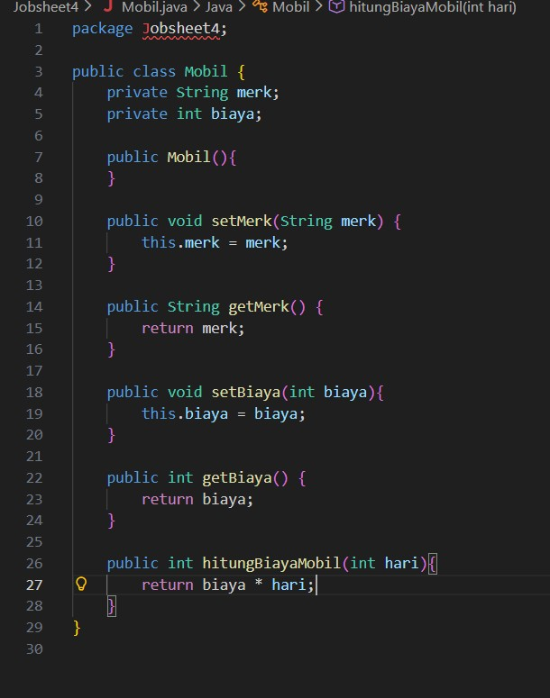
> 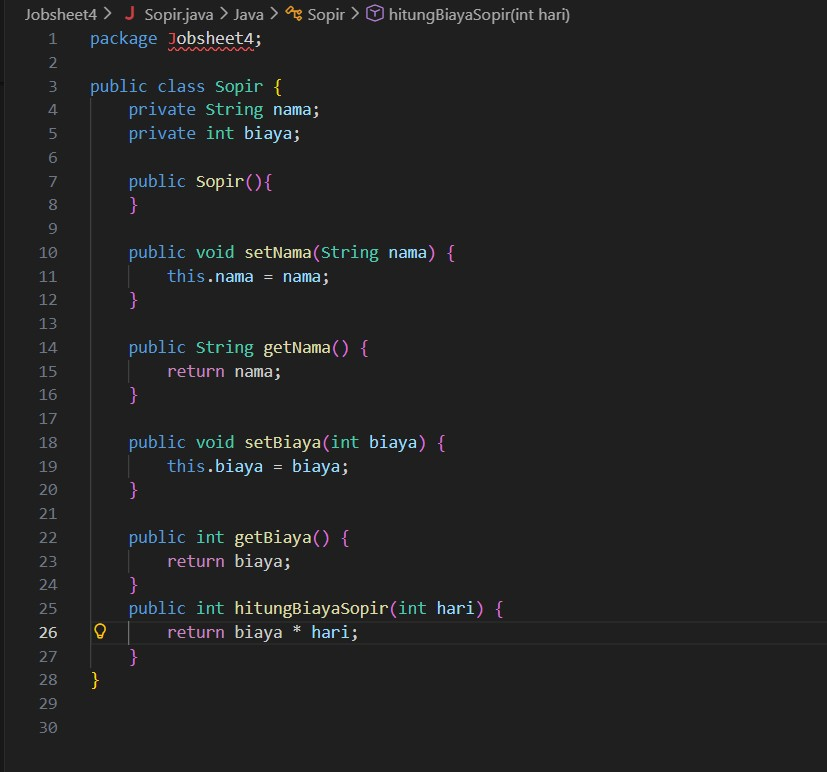
> 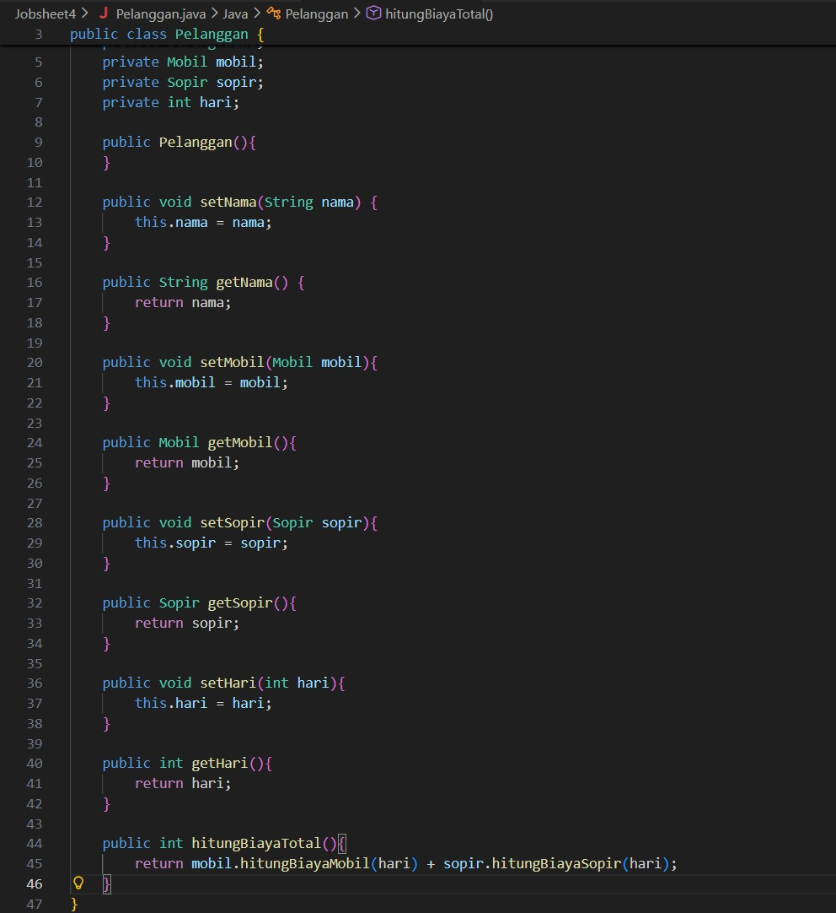
> 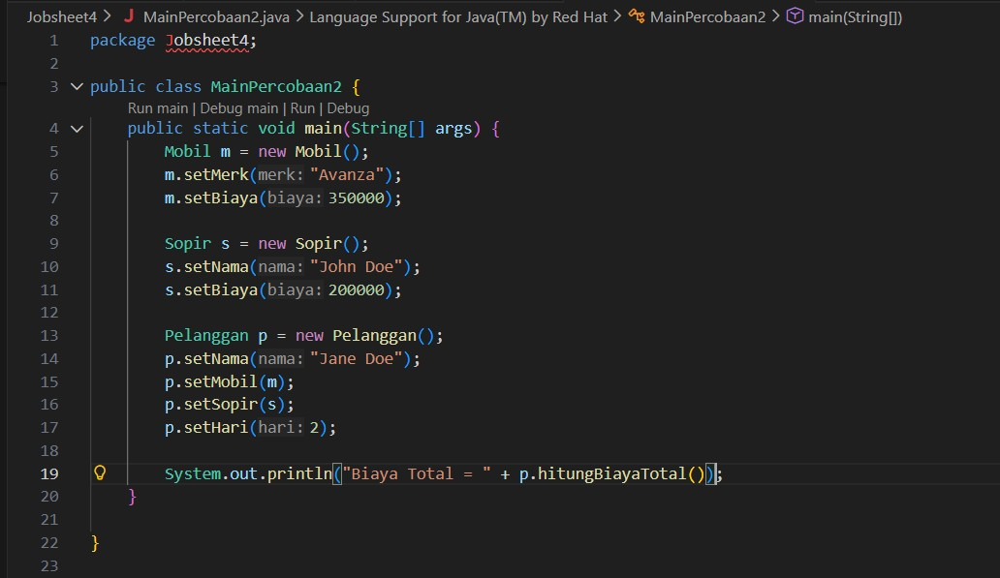

Checkpoint:
> 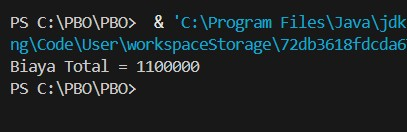

Checkpoint:
> 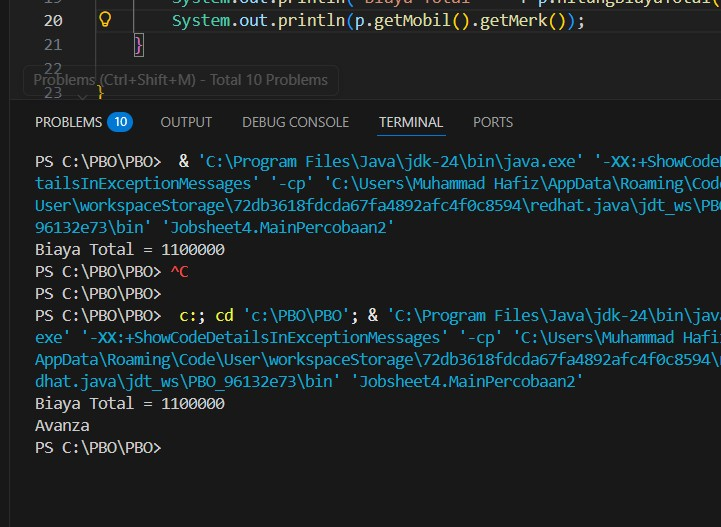

### Pertanyaan
1. Perhatikan class Pelanggan. Pada baris program manakah yang menunjukkan bahwa class Pelanggan memiliki relasi dengan class Mobil dan class Sopir?
2. Perhatikan method hitungBiayaSopir pada class Sopir, serta method hitungBiayaMobil pada class Mobil. Mengapa method tersebut harus memiliki argument hari, padahal hari sendiri adalah atribut milik Pelanggan, bukan milik Mobil atau Sopir?
3. Perhatikan kode dari class Pelanggan. Untuk apakah perintah mobil.hitungBiayaMobil(hari) dan sopir.hitungBiayaSopir(hari)?
4. Perhatikan class MainPercobaan2. Untuk apakah sintaks p.setMobil(m) dan p.setSopir(s)?
5. Untuk apakah proses p.hitungBiayaTotal()?
6. Pada Langkah 7, p.getMobil().getMerk() memanggil dua method sekaligus secara berantai. Jelaskan urutan eksekusinya: objek apa yang dikembalikan p.getMobil(), dan objek apa yang kemudian dipanggil .getMerk()-nya?
7. Andaikan p.setMobil(m) tidak pernah dipanggil lalu p.hitungBiayaTotal() dijalankan, error
apa yang akan muncul? Jelaskan mengapa error itu terjadi, dikaitkan dengan konsep referensi objek yang sudah kita pelajari sebelumnya. 

### Jawaban
1. Relasi tersebut ditunjukkan pada baris pendeklarasian atribut bertipe objek di dalam class Pelanggan, yaitu private Mobil mobil; dan private Sopir sopir;.
2. Method tersebut membutuhkan argumen hari karena data jumlah hari penyewaan hanya dimiliki oleh objek Pelanggan. Oleh karena itu, nilainya harus dikirimkan dari Pelanggan ke objek Mobil dan Sopir agar kalkulasi biaya dapat dilakukan.
3. Perintah tersebut digunakan sebagai bentuk delegasi, di mana Pelanggan menyuruh objek mobil dan sopir miliknya untuk menghitung biayanya masing-masing berdasarkan jumlah hari sewa yang diberikan.
4. Sintaks tersebut berfungsi untuk menginjeksikan referensi objek Mobil m dan Sopir s yang telah dibuat di method utama ke dalam atribut milik objek Pelanggan p.
5. Proses tersebut bertujuan untuk mengkalkulasi dan mengembalikan total keseluruhan biaya sewa, yang didapatkan dari penjumlahan biaya mobil dan biaya sopir.
6. Urutan eksekusinya dimulai dari eksekusi p.getMobil() yang pertama-tama mengembalikan objek referensi Mobil milik pelanggan. Setelah objek Mobil tersebut didapatkan, barulah method .getMerk() dipanggil dari objek Mobil tersebut untuk mengembalikan nilai string merk.  
7. Error yang akan muncul adalah NullPointerException. Hal ini terjadi karena referensi atribut mobil di dalam objek Pelanggan masih bernilai null atau belum merujuk ke instansiasi objek manapun di memori, sehingga program akan crash ketika mencoba mengakses method dari sesuatu yang kosong.   

## Percobaan 3: Aggregation dengan Dua Role ke Kelas yang Sama (Kereta Api)
> 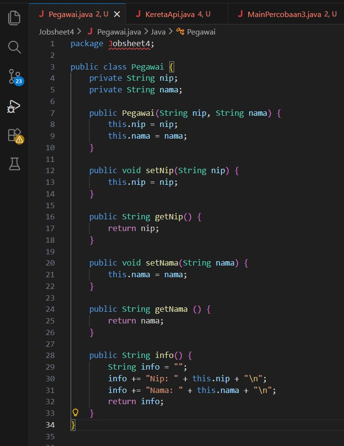
> 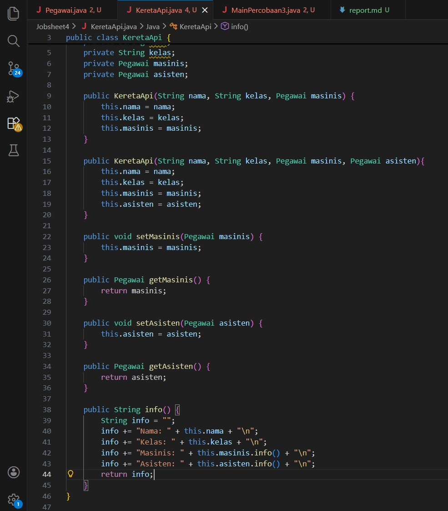
> 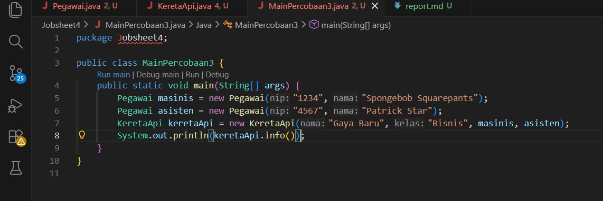

Checkpoint:
> 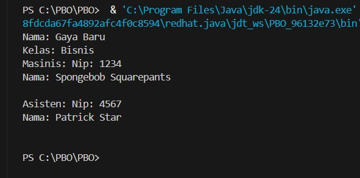

Checkpoint:
> 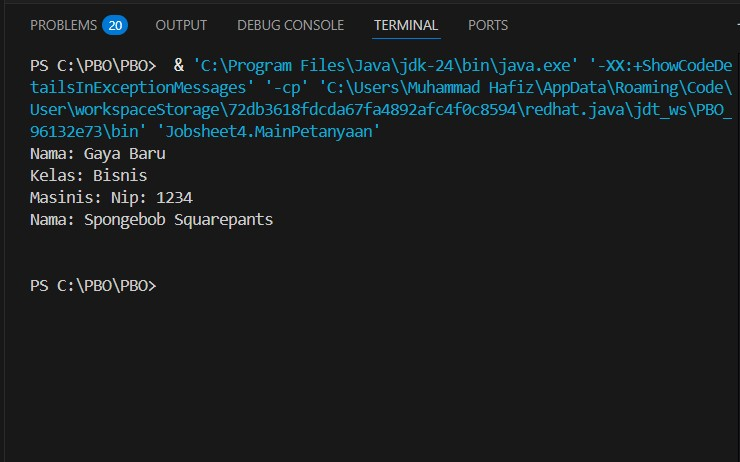

### Pertanyaan
1. Di dalam method info() pada class KeretaApi, baris this.masinis.info() dan this.asisten.info() digunakan untuk apa?
2. Apa hasil output dari MainPertanyaan sebelum diperbaiki (Langkah 8)? Mengapa hal tersebut dapat terjadi?
3. Kaitkan dengan materi referensi objek: apa isi variabel asisten di dalam objek KeretaApi yang dibuat lewat constructor 3-parameter, sebelum guard clause ditambahkan?
4. Setelah guard clause ditambahkan (Langkah 9), apakah objek masinis juga perlu dicek dengan cara yang sama? Perhatikan kedua constructor KeretaApi, apakah mungkin masinis bernilai null? Jelaskan.
5. Kelas Pegawai dipakai lewat dua atribut berbeda (masinis dan asisten) pada KeretaApi. Apakah ini membuat KeretaApi punya dua objek Pegawai yang berbeda, atau satu objek Pegawai yang dipakai dua kali? Jelaskan berdasarkan kode pada Langkah 6. 

### Jawaban
1. Baris tersebut berfungsi sebagai delegasi, di mana objek KeretaApi menyuruh objek masinis dan asisten untuk mengeksekusi method cetak informasi mereka masing-masing.
2. Outputnya adalah error NullPointerException. Error ini terjadi karena objek KeretaApi dibuat tanpa asisten, sehingga atribut asisten bernilai kosong (null), namun program mencoba memanggil method .info() dari referensi yang kosong tersebut.
3. Isi variabel asisten adalah null karena tidak pernah diinisialisasi atau diisi referensi objek Pegawai melalui konstruktor 3-parameter.
4. Objek masinis tidak perlu dicek karena pada kedua konstruktor KeretaApi parameter masinis wajib diisi dan langsung dialokasikan ke atribut this.masinis, sehingga referensinya tidak mungkin bernilai null.
5. KeretaApi memiliki dua objek Pegawai yang berbeda. Hal ini terbukti dari Langkah 6 di mana terdapat dua instansiasi objek (new Pegawai) yang terpisah untuk kemudian dimasukkan ke parameter masinis dan asisten.

## Percobaan 4: Array of Object dan Multiplicity (Gerbong, Kursi, dan Penumpang)
> 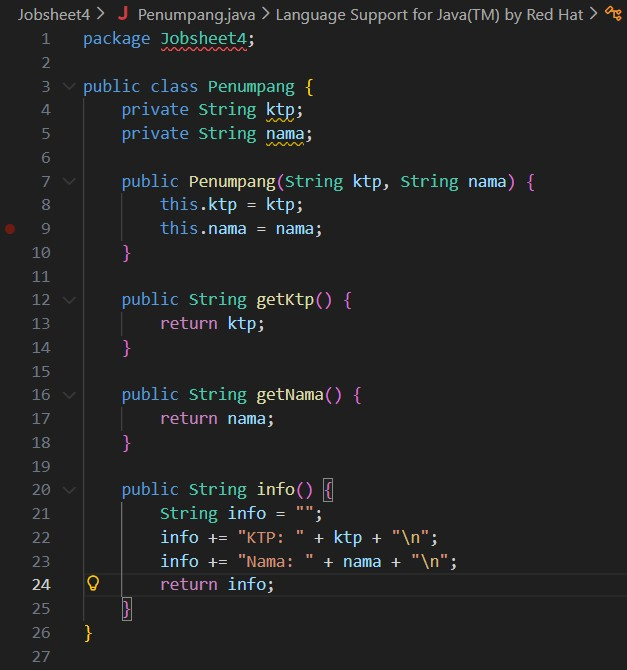
> 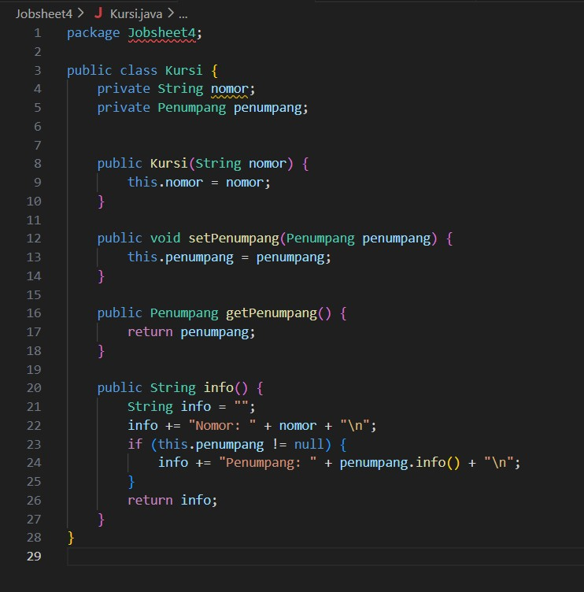
> 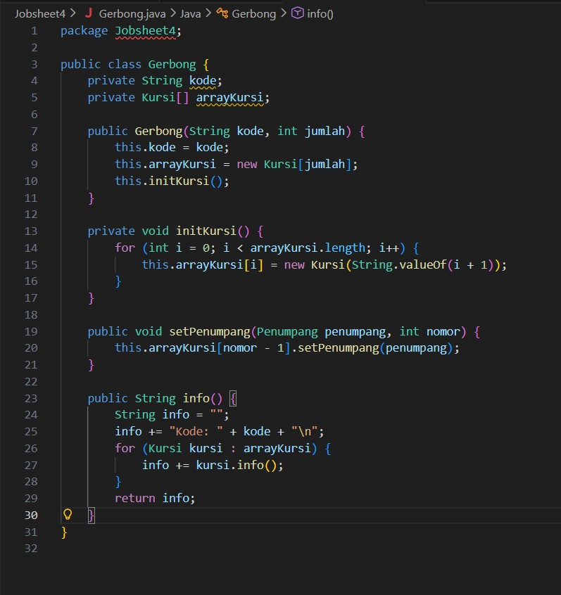
> 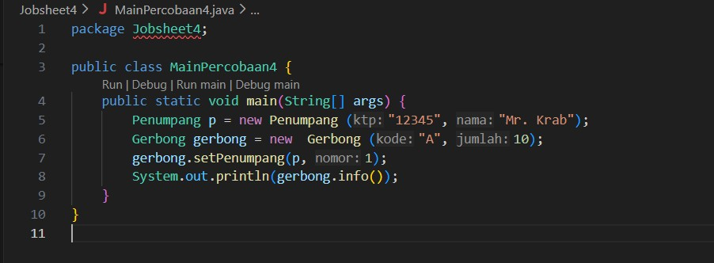

Checkpoint:
> 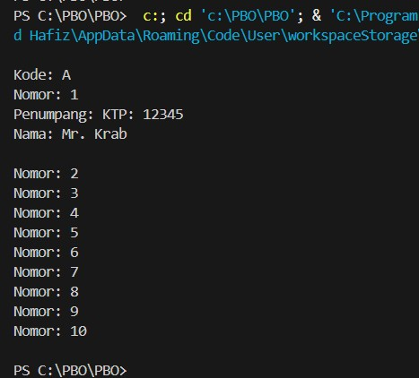

### Pertanyaan
1. Pada main program dalam class MainPercobaan4, berapakah jumlah kursi dalam Gerbong A?
2. Perhatikan potongan kode if (this.penumpang != null) { ... } pada method info() dalam class Kursi. Apa maksud kode tersebut?
3. Mengapa pada method setPenumpang() dalam class Gerbong, nilai nomor dikurangi dengan angka 1?
4. Instansiasi objek baru budi dengan tipe Penumpang, kemudian masukkan objek baru tersebut pada gerbong dengan gerbong.setPenumpang(budi, 1), menimpa Mr. Krab yang sudah duduk di sana. Apakah yang terjadi? Apakah Java memberi peringatan/error?
5. Modifikasi program sehingga tidak diperkenankan menduduki kursi yang sudah ada penumpang lain (tambahkan pengecekan pada Gerbong.setPenumpang() sebelum baris arrayKursi[nomor - 1].setPenumpang(...) dijalankan).
6. Bandingkan tiga bentuk relasi has-a yang sudah kita praktikkan: Laptop-Processor (Percobaan 1, 1- 1), KeretaApi-Pegawai (Percobaan 3, dua relasi 1-1 bernama), dan Gerbong-Kursi (Percobaan 4, 1..*). Untuk kasus seperti apa kita akan memilih array, dan untuk kasus seperti apa kita akan memilih atribut bernama satu-satu?
7. Terapkan kriteria kode (siapa yang memanggil new) pada dua relasi has-a di Percobaan ini: GerbongKursi dan Kursi-Penumpang. Manakah yang Aggregation dan manakah yang Composition? Tunjukkan baris kode yang menjadi bukti untuk masing-masing.

### Jawaban
1. Terdapat 10 kursi di dalam Gerbong A.
2. Kode tersebut adalah guard clause yang mengecek apakah kursi sudah diduduki (referensi tidak null) sebelum memanggil method info penumpang, guna mencegah program berhenti akibat NullPointerException.
3. Indeks dikurangi 1 karena struktur data array pada Java selalu dimulai dari indeks 0, sehingga kursi nomor urut 1 akan disimpan pada array indeks ke-0.
4. Data Penumpang lama akan langsung tertimpa oleh data Penumpang baru, dan Java tidak akan menampilkan peringatan atau error apapun.  
5. Modifikasi dilakukan dengan menambahkan struktur kontrol kondisi if (this.arrayKursi[nomor - 1].getPenumpang() == null) pada method setPenumpang() di class Gerbong sebelum melakukan pengisian data penumpang baru.
6. Array digunakan jika terdapat relasi satu-ke-banyak (1..*) di mana objek berjumlah banyak dan tidak membutuhkan identitas peran khusus, sedangkan atribut bernama tunggal dipakai jika jumlah objeknya spesifik dan perannya berbeda secara eksplisit.
7. Relasi Gerbong-Kursi adalah Composition karena Gerbong menginstansiasi objek Kursi sendiri dengan new Kursi() di dalam method initKursi(). Relasi Kursi-Penumpang adalah Aggregation karena objek Penumpang dibuat di luar lalu dimasukkan ke dalam atribut kursi melalui method setter. 

## Percobaan 5: Composition (Mobil dan Mesin)
> 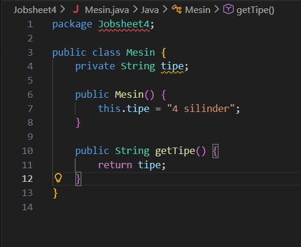
> 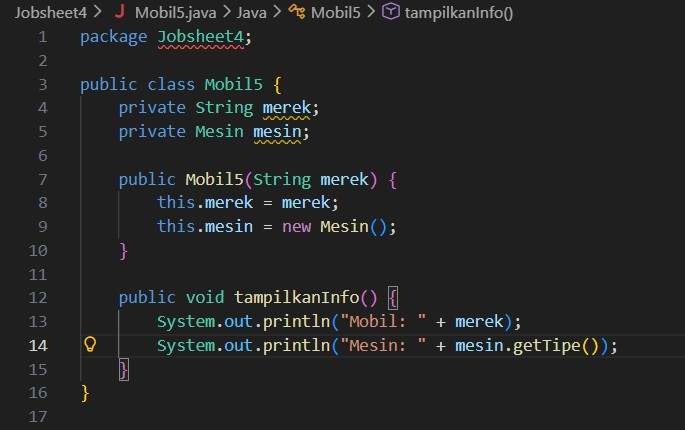
> 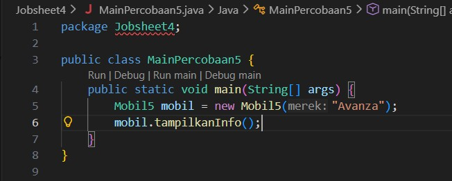

### Pertanyaan
1. Pada class Mobil, baris manakah yang menunjukkan bahwa Mesin adalah bagian yang “dimiliki secara eksklusif” oleh Mobil (bukan sekadar “dipinjam”)?
2. Apa yang terjadi secara desain jika ditambahkan method setMesin(Mesin mesin) pada class Mobil? Apakah relasi ini akan tetap menjadi Composition? Jelaskan.
3. Bandingkan dengan Percobaan 1 (Laptop-Processor): sebutkan satu perbedaan baris kode yang membuat salah satunya Aggregation dan yang lain Composition.
4. Jika objek mobil di MainPercobaan5 di-set null setelah tampilkanInfo() dipanggil, apa yang terjadi pada objek Mesin miliknya? Bandingkan dengan nasib objek Processor pada Percobaan 1 seandainya objek Laptop-nya dihapus, apakah Processor tersebut masih bisa “diselamatkan” oleh kode lain? Kenapa Mesin tidak bisa?
5. Coba (secara terpisah, boleh di file/package percobaan sendiri) tambahkan constructor kedua pada Mobil yang menerima parameter Mesin, mirip pola Percobaan 1: public Mobil(String merek, Mesin mesin) { this.merek = merek; this.mesin = mesin; }. Kalau constructor ini yang dipakai, apakah Mobil-Mesin berubah menjadi Aggregation? Jelaskan alasannya.

### Jawaban
1. Hal tersebut dibuktikan oleh instruksi this.mesin = new Mesin(); yang diletakkan langsung di dalam blok konstruktor class Mobil.
2. Relasi tersebut akan berubah menjadi Aggregation. Keberadaan method setter membuat siklus hidup objek Mesin tidak lagi terikat mutlak pada class Mobil karena nilainya bisa ditimpa kapan saja dari luar.
3. Pada relasi Aggregation objek dikirim dari luar melalui parameter konstruktor, sedangkan pada Composition class memanggil instruksi new sendiri untuk membentuk objek bagiannya.
4. Objek Mesin akan ikut musnah karena referensinya hanya dipegang secara eksklusif oleh objek Mobil. Berbeda dengan objek Processor yang masih bertahan di memori apabila referensi variabel pengisinya di method main masih aktif.   
5. Ya, relasi tersebut berubah menjadi Aggregation. Penggunaan parameter Mesin pada konstruktor menunjukkan bahwa objek Mesin diinstansiasi di luar class Mobil, sehingga siklus hidupnya bebas dan tidak sepenuhnya dikendalikan oleh class Mobil.

## percobaan 6: Dependency / Uses-A (Laptop Mencetak Dokumen ke Printer) 
> 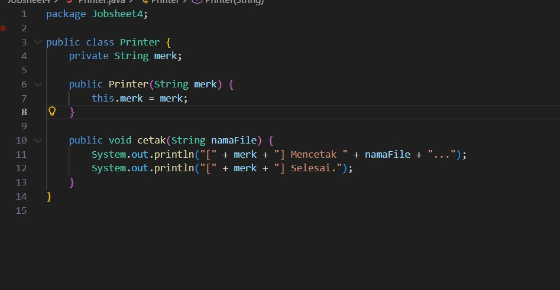
> 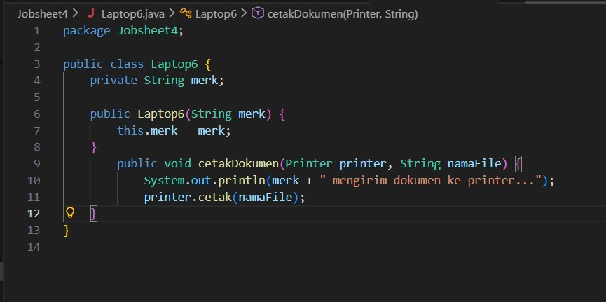
> 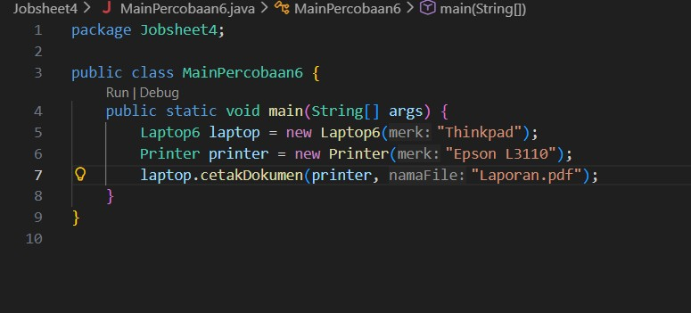
> 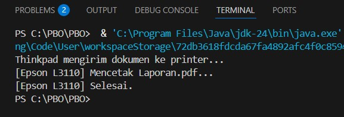

### Pertanyaan
1. Apakah class Laptop pada percobaan ini memiliki atribut bertipe Printer? Bandingkan dengan Percobaan 1, di mana Processor disimpan sebagai atribut Laptop.
2. Setelah method cetakDokumen() selesai dijalankan, apakah Laptop masih menyimpan referensi ke objek printer yang tadi dipakai? Jelaskan berdasarkan baris kode class Laptop.
3. Mengapa relasi Laptop-Printer pada percobaan ini disebut Dependency (uses-a), bukan Aggregation, meskipun sama-sama melibatkan dua objek yang saling berinteraksi?
4. Coba ubah kode Laptop supaya Printer disimpan sebagai atribut (mis. private Printer printerDefault, diisi lewat constructor atau setter, lalu dipakai kembali di cetakDokumen() tanpa parameter Printer). Apakah relasi ini sekarang berubah dari Dependency menjadi Aggregation? Jelaskan.
5. Lengkapi tabel berikut dengan kata-katamu sendiri (boleh dijawab di laporan): untuk masing-masing dari Aggregation, Composition, dan Dependency, sebutkan (a) apakah objek part disimpan sebagai atribut atau tidak, dan (b) siapa yang memanggil new untuk membuat objek part tersebut.    

### Jawaban
1. Tidak, class Laptop pada percobaan tersebut sama sekali tidak mendeklarasikan atribut bertipe Printer.
2. Tidak, setelah method selesai dieksekusi referensi parameter akan dihapus otomatis dari memori sehingga Laptop tidak akan mengingat objek Printer tersebut lagi.
3. Relasi disebut Dependency karena Laptop hanya meminjam objek Printer sementara waktu di dalam alur eksekusi method tanpa menyimpannya secara permanen sebagai variabel status class.
4. Ya, relasi akan berubah menjadi Aggregation karena objek Printer mulai disimpan secara menetap sebagai atribut class Laptop, bukan sekadar numpang lewat sementara sebagai argumen method.
5. Pada Aggregation objek disimpan sebagai atribut dan pemanggilan new dilakukan di luar class. Pada Composition objek disimpan sebagai atribut dan pemanggilan new dilakukan di dalam class itu sendiri. Pada Dependency objek tidak disimpan sebagai atribut dan pemanggilan new dilakukan di luar class.

